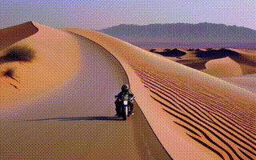
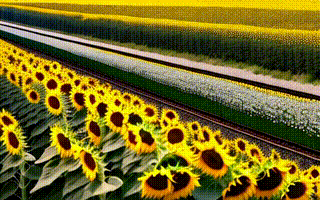
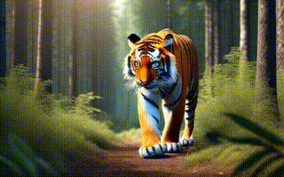
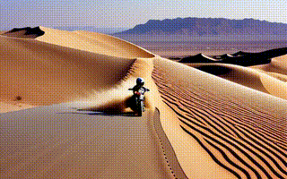
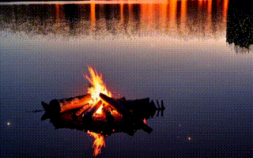
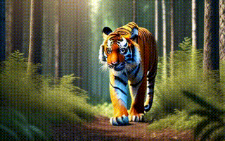

<h1 align="center">FreSca: Scaling in Frequency Space Enhances Diffusion Models</h1>
<h5 align="center" style="color:gray">
  <a href="https://wikichao.github.io/" target="_blank" rel="noopener noreferrer">Chao Huang</a>, 
  <a href="https://liangsusan-git.github.io/" target="_blank" rel="noopener noreferrer">Susan Liang</a>, 
  <a href="https://yunlong10.github.io/" target="_blank" rel="noopener noreferrer">Yunlong Tang</a>, 
  <a href="https://scholar.google.com/citations?user=ZyCYhUkAAAAJ&hl=en" target="_blank" rel="noopener noreferrer">Jing Bi</a>, 
  <a href="https://limacv.github.io/homepage/" target="_blank" rel="noopener noreferrer">Li Ma</a>, 
  <a href="https://www.yapengtian.com/" target="_blank" rel="noopener noreferrer">Yapeng Tian</a>, 
  <a href="https://www.cs.rochester.edu/~cxu22/" target="_blank" rel="noopener noreferrer">Chenliang Xu</a><br>
</h5>
<h5 align="center" style="color:gray">
  University of Rochester, Hong Kong University of Science and Technology, The University of Texas at Dallas
</h5>
<h5 align="center"> If our project helps you, please give us a star ⭐ on GitHub to support us. </h5>

<h5 align="center">
<a href="https://wikichao.github.io/FreSca/"></a>  <a href="https://arxiv.org/pdf/2504.02154"></a> <a href="https://huggingface.co/papers/2504.02154"></a>    
</h5>

<div align="center" style="padding: 15px; background-color: #f0f7fb; border-left: 5px solid #3498db; margin: 20px 0; border-radius: 3px;">
  <b>💡 Where and why you should apply Frequency Scaling in diffusion models.</b>
</div>

<!-- <p align="center">
  <video width="80%" controls>
    <source src="./assets/demo.mp4" type="video/mp4">
    Your browser does not support the video tag.
  </video>
  <br>
  <em>FreSca: Enhancing video diffusion models through frequency space scaling</em>
</p> -->

## 📋 Overview

FreSca is a novel frequency scaling approach that enhances diffusion models without additional training.
Our key findings:
- Frequency scaling improves visual quality with minimal computational overhead
- Energy-based cutoff strategy provides stable and consistent improvements
- Compatible with existing diffusion models as a plug-and-play enhancement (image generation, video generation, depth estimation, image editing)

## 📰 News

- **[2025-05]** 🔥 **Major Update!** Our new version reveals the optimal locations for frequency scaling, showing improvements across image generation, video synthesis, depth estimation, and editing tasks. New energy-based cutoff technique delivers superior stability!
- **[2025-04]** Exciting discovery! **FreSca** boosts video diffusion models' performance without training! Preliminary [VideoCrafter2](https://github.com/AILab-CVC/VideoCrafter) results added.
- **[2025-04]** Released example implementation for **FreSca**.

## 🎬 Gallery

### Video Generation Results

<table>
<tr>
    <td colspan="5" align="center"><b>VideoCrafter2: Original vs FreSca</b></td>
</tr>
<tr>
    <td colspan="5" align="center"><b>Original</b></td>
</tr>
<tr>
    <td>
        <a href="./demo/VideoCrafter2/Origin1/0006.mp4">
            
        </a>
    </td>
    <td>
        <a href="./demo/VideoCrafter2/Origin1/0007.mp4">
            
        </a>
    </td>
    <td>
        <a href="./demo/VideoCrafter2/Origin1/0008.mp4">
            
        </a>
    </td>
    <td>
        <a href="./demo/VideoCrafter2/Origin1/0010.mp4">
            
        </a>
    </td>
    <td>
        <a href="./demo/VideoCrafter2/Origin/0001.mp4">
            
        </a>
    </td>
</tr>
<tr>
    <td colspan="5" align="center"><b>FreSca</b></td>
</tr>
<tr>
    <td>
        <a href="./demo/VideoCrafter2/Fresca1/0006.mp4">
            
        </a>
        <div align="center"><i>"A motorcycle riding along a desert highway, sand dunes stretching beside"</i></div>
    </td>
    <td>
        <a href="./demo/VideoCrafter2/Fresca1/0007.mp4">
            
        </a>
        <div align="center"><i>"Lanterns drifting into the night sky, a calm lake mirroring their glow"</i></div>
    </td>
    <td>
        <a href="./demo/VideoCrafter2/Fresca1/0008.mp4">
            
        </a>
        <div align="center"><i>"A train winding through sunflower fields, bright yellow blooms on both sides"</i></div>
    </td>
    <td>
        <a href="./demo/VideoCrafter2/Fresca1/0010.mp4">
            
        </a>
        <div align="center"><i>"A campfire on a lakeshore, stars sparkling in the dark sky"</i></div>
    </td>
    <td>
        <a href="./demo/VideoCrafter2/Fresca/0001.mp4">
            
        </a>
        <div align="center"><i>"A tiger walks in the forest, photorealistic, 4k, high definition"</i></div>
    </td>
</tr>
</table>

<p align="left"><i>Click on any GIF to view the full MP4 video.</i></p>


### Depth Estimation Results

<div align="center">
  
  <p><i>FreSca enhances depth estimation quality by preserving fine details and improving edge accuracy.</i></p>
</div>

## 🤖 Implementation

The core implementation is available in `core/fresca.py` and can be easily integrated into any diffusion model.

### Key Components

1. **Frequency Space Transformation**: Convert latent features to frequency domain using FFT
2. **Selective Scaling**: Apply customizable scaling to low- or high-frequency components
3. **Energy-based Cutoff**: Adaptive boundary determination for frequency scaling

### Recommended Parameters

- **Cutoff ratio**: 0.5~0.9 (energy-based approach)
- **High-frequency scaling factor**: 1.0 < h < 1.5
- **Position**: Apply the nosie predictions

Find more example implementations in the `demo/` directory.

## 📑 Citation

If you use this code for your research, please cite our work:
```
@article{huang2025fresca,
        title={FreSca: Unveiling the Scaling Space in Diffusion Models},
        author={Huang, Chao and Liang, Susan and Tang, Yunlong and Ma, Li and Tian, Yapeng and Xu, Chenliang},
        journal={arXiv preprint arXiv:2504.02154},
        year={2025}
}
```

## 📧 Contact

For questions or feedback, please open an issue on GitHub or contact the authors directly.
